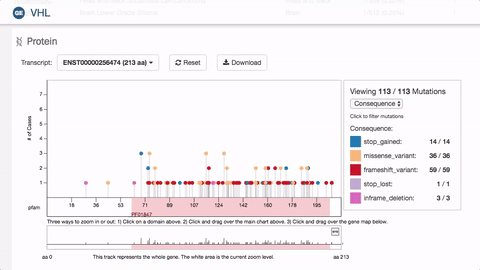

Protein Lolliplot :lollipop: :bar_chart:
=====================



Visualization to view relationship between common mutations and their location on a gene.

### Install

```
yarn
```

# API

```
type TProteinLolliplotArgs = {
  selector: string,
  data: Object,
  domainWidth: number,
  onMutationClick: ?Function,
  height: ?number,
  width: ?number,
  hideStats: ?bool,
  selectedMutationClass: ?string,
}
```

`selector`: the selector of the element to attach the chart to

`data`: an object containing an array of proteins and an array of mutations (TODO: add shape)

`domainWidth`: The amino acid length of the transcript

`onMutationClick (optional)`: callback that receives the data of the clicked mutation

`width (optional)`: width of the chart

`height (optional)`: height of the chart

`hideStats (optional)`: if `true`, do not display the summary box next of the chart

`selectedMutationClass (optional)`: sets the default filter on the mutation class (Consequence, Impact, etc)
